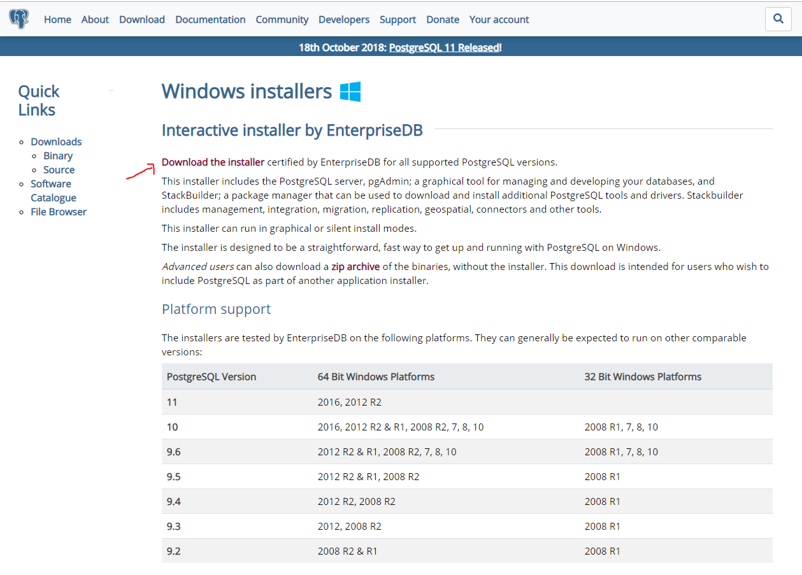
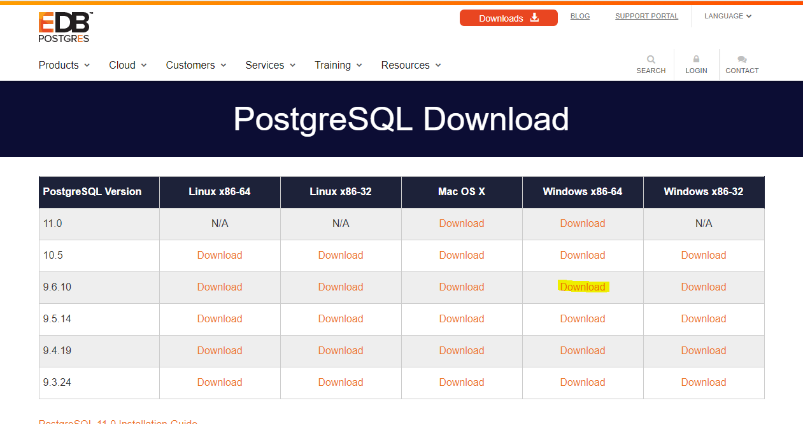
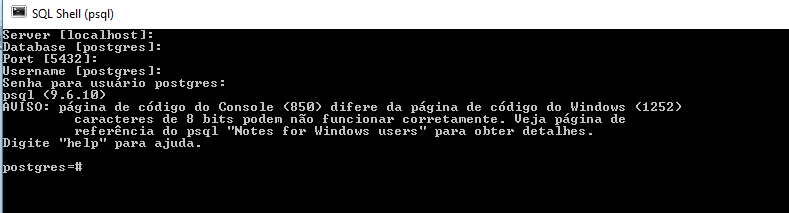

# 1. Instalando o PostgreSQL no Linux

Referências:

https://www.digitalocean.com/community/tutorials/como-instalar-e-utilizar-o-postgresql-no-ubuntu-16-04-pt


http://www.postgresqltutorial.com/postgresql-backup-database/


```bash
sudo apt-get update
sudo apt-get install postgresql postgresql-contrib
```

O procedimento de instalação criou um usuário chamado postgres que é associado com o role padrão do Postgres. Para usar o Postgres, podemos fazer login nessa conta.

Alterne para a conta postgres no seu servidor digitando:

```bash
sudo -i -u postgres
```

## 1.1. Criando Usuário

Primeiro, logue-se:

```bash
sudo -i -u postgres psql
postgres=# CREATE USER <username>;
```

Liste os usuários criados:

```bash
=# SELECT usename FROM pg_user;
```

Para listarmos as Roles digite:

```bash
\du
```

Exemplo:

```bash
postgres=# CREATE USER ampere;
CREATE ROLE
postgres=# SELECT usename FROM pg_user;
 usename
----------
 postgres
 ampere
(2 rows)

postgres=# \du
                                   List of roles
 Role name |                         Attributes                         | Member of
-----------+------------------------------------------------------------+-----------
 ampere    |                                                            | {}
 postgres  | Superuser, Create role, Create DB, Replication, Bypass RLS | {}
```

## 1.2. Alterando o usuário para Superuser

```bash
ALTER USER ampere WITH SUPERUSER;
```


## 1.3. Criando uma Senha para o Usuário

```bash
sudo -u postgres psql
psql=\# alter user <username> with encrypted password '<password>';
```

## 1.4. Dando Permissões ao Usuário

```bash
psql=\# grant all privileges on database <dbname> to <username> ;
```


## 1.5. Conceitos de permissão do PostgreSQL
O PostgreSQL (ou simplesmente "postgres") gerencia permissões através do conceito de "papéis" "ROLES".

As funções são diferentes das permissões tradicionais no estilo Unix, pois não há distinção entre usuários e grupos. As funções podem ser manipuladas para se assemelhar a essas convenções, mas também são mais flexíveis.

Por exemplo, os papéis podem ser membros de outros papéis, permitindo que eles assumam as características de permissão de papéis previamente definidos. As funções também podem possuir objetos e controlar o acesso a esses objetos para outras funções.

## 1.6. Como visualizar funções no PostgreSQL
Podemos visualizar as funções atuais definidas no PostgreSQL, fazendo login na interface de prompt com o seguinte comando:

```bash
sudo -u postgres psql
```

Para obter uma lista de funções, digite isto:

```bash
\du
```

## 1.7. Fazendo Backup com PostgreSQL

Versão testada:

```bash
 pg_dump --username postgres --host localhost <nomedb> | gzip -c > backup.sql.gz
```

Versão testada, porém, pede a senha do usuário postgres:

```bash
pg_dump -h localhost -U postgres -W -F t nome_do_bd > nome_do_bd.tar
```


Examinando o comando:

-U postgres:  especifica o usuário que se conectará.

-W: força o pg_dump a perguntar o password antes de conectar-se.

-F : especifica o formato da saída do arquivo. que pode ser uma das seguintes: 

	*  c: formato personalizado 
	*  d: arquivo em formato de diretório
	*  t: tar
	*  p: arquivo texto de SQL 


## 1.8. Criando BD

```bash
sudo -u postgres createdb modelos
```

ou, depois de logar:

```bash
sudo -u postgres psql

# CREATE DATABASE modelos;
```

## 1.9. DROP DATABASE 

```
SELECT pg_terminate_backend(pid) FROM pg_stat_activity WHERE datname = 'modelos';
```

## 1.10. Restaurando um Banco de Dados

```bash
pg_restore -d <nomebd>.tar

pg_restore -h localhost -U postgre -W -F t -d modelos Modelos.tar
```

## 1.11. Instalando PgAdmin3 no Ubuntu 16

```
sudo apt-get install pgadmin3
```

Once the installation has finished, it's time to set up a password for the main account; you'll log in to postgresql:

The version of postgres may vary slightly depending upon the Ubuntu version

```bash
sudo -u postgres psql postgres
```

```
psql (9.1.10)
Type "help" for help.
And then type \password postgres, and you'll be prompted for your password:

postgres=# \password postgres
```

## 1.12. Instalando PostgreSQL no Windows

O objetivo é instalarmos o PostgreSQL para depois trabalharmos com o Laravel na parte de desenvolvimento do **backend** utilizando o servidor embutido **artisan**. 

No windows a instalação é feita através de um arquivo binário que pode ser baixado em:

https://www.postgresql.org/download/windows/




Depois de clicar em Download Installers você será redirecionado para:

https://www.enterprisedb.com/downloads/postgres-postgresql-downloads




Neste momento (25/10/2019) foi lançado o PostgreSQL 11, porém, ainda utilizaremos a versão 9.6.


## 1.13. Configurando o WampServer no Windows para PostgreSQL

Abra o terminal do DOS no windows e digite:

```bash
php -v
```

Você verá qual é a versão do PHP que você está utilizando. Lembrando que para o Laravel é necessário PHP 7.1+.  Caso não esteja configurado para esta versão basta ir no ícone do Wampserver próximo ao relógio do windows e alterá-la para que comece a utilizar uma versão de PHP 7.1+. No meu caso, neste momento tenho a versão PHP 7.1.9.

Portanto, a saída do comando é:

```bash
PHP 7.1.9 (cli) (built: Aug 30 2017 18:34:46) ( ZTS MSVC14 (Visual C++ 2015) x64 )
Copyright (c) 1997-2017 The PHP Group
Zend Engine v3.1.0, Copyright (c) 1998-2017 Zend Technologies
    with Xdebug v2.6.0, Copyright (c) 2002-2018, by Derick Rethans
```

Uma vez confirmado que a versão do PHP é 7.1+ verifique qual é o arquivo **PHP.INI** que está sendo utilizado.

```bash
php --ini
```

```bash
Configuration File (php.ini) Path: C:\WINDOWS
Loaded Configuration File:         C:\wamp64\bin\php\php7.1.9\php.ini
Scan for additional .ini files in: (none)
Additional .ini files parsed:      (none)
```

Pronto, agora sabemos que devemos editar o arquivo **C:\wamp64\bin\php\php7.1.9\php.ini**. Vá até este arquivo e descomente (remova o ; do início da linha) os drivers do PDO para PostgreSQL:

```
;extension=php_pdo_firebird.dll
extension=php_pdo_mysql.dll
;extension=php_pdo_oci.dll
;extension=php_pdo_odbc.dll
extension=php_pdo_pgsql.dll
extension=php_pdo_sqlite.dll
extension=php_pgsql.dll
```

Em geral, sempre teremos descomentado o **sqlite**, **mysql** e agora o **pgsql**.

Para garantir que irá funcionar quando fizermos a **migration** do laravel execute o comando redirecionando a saída para um arquivo TXT para facilitar a visualização depois, pois a saída é um pouco grande.

```bash
php -i > c:\wamp64\www\SAIDA.txt
```

Abra o arquivo **SAIDA.txt** e confira se encontra as linhas:

```ini
PDO

PDO support => enabled
PDO drivers => mysql, pgsql, sqlite

pdo_mysql

PDO Driver for MySQL => enabled
Client API version => mysqlnd 5.0.12-dev - 20150407 - $Id: b396954eeb2d1d9ed7902b8bae237b287f21ad9e $

pdo_pgsql

PDO Driver for PostgreSQL => enabled
PostgreSQL(libpq) Version => 9.6.2
Module version => 7.1.9
Revision =>  $Id: 93712a6af603ebb2ee5792c5be271d4d03edfbde $ 

pdo_sqlite

PDO Driver for SQLite 3.x => enabled
SQLite Library => 3.15.1

pgsql

PostgreSQL Support => enabled
PostgreSQL(libpq) Version => 9.6.2
PostgreSQL(libpq)  => PostgreSQL 9.6.2 (win32)
Multibyte character support => enabled
SSL support => enabled
Active Persistent Links => 0
Active Links => 0

Directive => Local Value => Master Value
pgsql.allow_persistent => On => On
pgsql.auto_reset_persistent => Off => Off
pgsql.ignore_notice => Off => Off
pgsql.log_notice => Off => Off
pgsql.max_links => Unlimited => Unlimited
pgsql.max_persistent => Unlimited => Unlimited
```

Pronto! Agora você pode testar criando um projeto Laravel:

```
composer create-project --prefer-dist laravel/laravel blog
```

Configurando o arquivo **.env** para:

```
DB_CONNECTION=pgsql
DB_HOST=localhost
DB_PORT=5432
DB_DATABASE=meubancodados
DB_USERNAME=admin
DB_PASSWORD=senhabd
```

Atenção: não se esqueça que a porta do POSTGRESQL é a 5432!

Crie o BD no windows utilizando o Prompt do PostgreSQL (localize teclando a tecla do Windows e buscando por SQL -> aparecerá SQL Shell (psql)).

Ele pedirá para você confirmar algumas informações, se for utilizar a default que está entre [], basta ir teclando ENTER:




Criando o BD no postgres (uma vez que esteja logado no ambiente):

```
CREATE DATABASE meubancodados;
```

```
postgres=# CREATE DATABASE meubancodados;
CREATE DATABASE
postgres=#
```

Para verificar:

```
postgres=# \l
                                            Lista dos bancos de dados
     Nome      |   Dono   | CodificaþÒo |        Collate         |         Ctype          | PrivilÚgios de acesso
---------------+----------+-------------+------------------------+------------------------+-----------------------
 meubancodados | postgres | UTF8        | Portuguese_Brazil.1252 | Portuguese_Brazil.1252 |
 postgres      | postgres | UTF8        | Portuguese_Brazil.1252 | Portuguese_Brazil.1252 |
 template0     | postgres | UTF8        | Portuguese_Brazil.1252 | Portuguese_Brazil.1252 | =c/postgres          +
               |          |             |                        |                        | postgres=CTc/postgres
 template1     | postgres | UTF8        | Portuguese_Brazil.1252 | Portuguese_Brazil.1252 | =c/postgres          +
               |          |             |                        |                        | postgres=CTc/postgres
 teste         | postgres | UTF8        | Portuguese_Brazil.1252 | Portuguese_Brazil.1252 |
(5 registros)


postgres=#
```

Criando o usuário de acesso:

```

```
