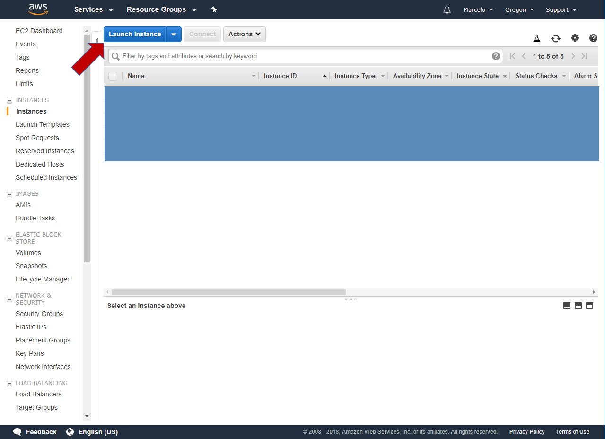

# 1. Montando uma Instância na Amazon

O objetivo é criar uma instância **T2 MICRO** com o **Ubuntu 18** 

Basta seguir as figuras e teremos um servidor montado.



# 2. SERVIDOR LINUX


## 2.1. Update

```bash
sudo apt-get update && sudo apt-get upgrade
```

## 2.2. Git

```bash
sudo apt install git
```

```bash
git config --global credential.helper cache
git config --global credential.helper 'cache --timeout=86400'
git config --global user.email "meumail@mail.com"
git config --global user.name "Nome Sobrenome"
```

## 2.3. Descompactadores

```bash
sudo apt-get install p7zip-full p7zip-rar rar unrar-free
```

## 2.4. PHP 7.3

https://thishosting.rocks/install-php-on-ubuntu/

```bash
sudo apt-get install software-properties-common
```

```bash
sudo add-apt-repository ppa:ondrej/php
```

```
sudo apt-get install php7.3
```

```
sudo apt-get install php-pear php7.3-curl php7.3-dev php7.3-gd php7.3-mbstring php7.3-zip php7.3-xml
```

Como o Nginx não contém processamento PHP nativo como alguns outros servidores da Web, você precisará instalar php-fpm, que significa "gerenciador de processos fastCGI". Vamos dizer ao Nginx para passar solicitações do PHP para este software para processamento.

Instale este módulo junto com um pacote auxiliar adicional que permitirá que o PHP se comunique com o back-end de seu banco de dados. A instalação irá puxar os arquivos essenciais do PHP. Faça isso digitando:

```
sudo apt-get install php7.3-fpm php7.3-mysql php7.3-pgsql
```

Versão:

```
ubuntu BACKEND_POSTGRE ~$ php -v
PHP 7.3.0RC4 (cli) (built: Oct 25 2018 10:32:09) ( NTS )
Copyright (c) 1997-2018 The PHP Group
Zend Engine v3.3.0-dev, Copyright (c) 1998-2018 Zend Technologies
    with Zend OPcache v7.3.0RC4, Copyright (c) 1999-2018, by Zend Technologies
```

## 2.5. COMPOSER

```bash
sudo apt-get install curl
```

```
curl -sS https://getcomposer.org/installer -o composer-setup.php
```

Acesse https://composer.github.io/pubkeys.html

```bash
php -r "if (hash_file('SHA384', 'composer-setup.php') === '93b54496392c062774670ac18b134c3b3a95e5a5e5c8f1a9f115f203b75bf9a129d5daa8ba6a13e2cc8a1da0806388a8') { echo 'Installer verified'; } else { echo 'Installer corrupt'; unlink('composer-setup.php'); } echo PHP_EOL;"
```

Finalmente para instalar faça:

```bash
sudo php composer-setup.php --install-dir=/usr/local/bin --filename=composer
```

Pronto, o composer está instalado!

Para verificar, basta digitar:

```bash
composer -v
```

## 2.6. MySQL 8.0 - autenticação Antiga

Atenção: nas opções de instalação do MySQL fique atento para escolher (atualmente) a autenticação (antiga do MySQL 5.6) e não a recomendada por chave.

Passo 1:

```
curl -OL https://dev.mysql.com/get/mysql-apt-config_0.8.10-1_all.deb
```

```
sudo dpkg -i mysql-apt-config*
```

**Atenção:** rode até a última opção "OK" e dê Enter.

Ao iniciar a instalação você deverá ver:

```
The following additional packages will be installed:
  libaio1 libmecab2 mecab-ipadic mecab-ipadic-utf8 mecab-utils mysql-client
  mysql-common mysql-community-client mysql-community-client-core
  mysql-community-server mysql-community-server-core
The following NEW packages will be installed:
  libaio1 libmecab2 mecab-ipadic mecab-ipadic-utf8 mecab-utils mysql-client
  mysql-common mysql-community-client mysql-community-client-core
  mysql-community-server mysql-community-server-core mysql-server
0 upgraded, 12 newly installed, 0 to remove and 0 not upgraded.
Need to get 57.1 MB/57.1 MB of archives.
```

Remova os pacotes antigos para que deixe somente o MySQL 8:

```
sudo apt autoremove
```

Atenção: se começar a instalar e ver que foi instalado o MySQL 5.7 você deverá removê-lo e voltar ao início do processo, tomando cuidado e escolher o OK correto.   

```
mysql -V
```

Se a saída for:

```bash
mpi UBUNTU18 ~/Downloads$ mysql -V
mysql  Ver 14.14 Distrib 5.7.24, for Linux (x86_64) using  EditLine wrapper
```

Desinstale:

```
sudo apt remove mysql-server
```

Execute o processo novamente:

```bash
```
sudo dpkg -i mysql-apt-config*
**Atenção:** rode até a última opção "OK" e dê Enter.
sudo apt-get install mysql-server
```

Atualmente é necessário rodar este comando com sudo:

```bash
sudo mysql_secure_installation
```

# NODE JS

Instalando o NodeJS utilizando NVM (Node Version Manager)

Uma alternativa para instalação do Node.js através do apt é usar uma ferramenta especialmente projetada, chamada nvm, que significa "Node.js version manager" ou "Gerenciador de Versão do Node.js".

Usando o nvm você pode instalar múltiplas versões, auto-contidas do Node.js que o permitirá controlar seu ambiente mais facilmente. 
Ele dará a você acesso sob demanda às mais novas versões do Node.js, 
mas também o permitirá apontar versões prévias que suas aplicações podem depender.

Para começar, precisaremos obter os pacotes de software do nosso repositório Ubuntu, que nos permitirão compilar pacotes de fontes. O script nvm aproveitará estas ferramentas para construir os componentes necessários:

```bash
sudo apt-get update
sudo apt-get install build-essential libssl-dev
```

Uma vez que os pacotes requeridos estejam instalados, você pode baixar o script de instalação do nvm da página do projeto GitHub (https://github.com/creationix/nvm). 

O número de versão pode ser diferente, mas em geral, você pode baixá-lo com o curl:

```bash
curl -o- https://raw.githubusercontent.com/creationix/nvm/v0.33.8/install.sh | bash

```
Abra um novo terminal para carregar o script inserido no seu **.bashrc**


Liste as versões de Node para instalar:

```bash
nvm ls-remote
```

Escolhemos a última LTS - versão estável e instalamos:

```bash
nvm install 8.12.4
```

Use o comando:

```bash
node -v
```


## Instalando

### Parando o Apache2

**Antes de instalar o NGINX verifique se existe o APACHE e remova-o:**

Execute o comando para verificar se o Apache está sendo executado:

```bash
service apache2 status
```

Pare o serviço do Apache:

```bash
sudo systemctl stop apache2.service
```

Previna o Apache de inicializar no Boot:

```bash
sudo systemctl disable apache2.service
```

Caso queira remover o Apache2 execute (COMANDO NÃO TESTADO):

```bash
sudo apt-get remove apache2 apache2-utils apache2.2-bin apache2.2-common libapache2-mod-php
```


## Instalando NGNIX

```
sudo apt-get install nginx -y
```


## Como verificar a instalação?
Ao final do processo de instalação, o Ubuntu 16.04 inicia o Nginx. O servidor web já deve estar em funcionamento.

Podemos checar com o sistema de init systemd para ter certeza de que o serviço está executando ao digitar:

```bash
sudo systemctl status nginx
```
ou 
```
sudo /etc/init.d/nginx status
```

**Testando:**

Se tentar acessar a URL e ainda aparecer a página do Apache2, é porque o NGINX não 
substituiu o arquivo **/var/www/html/index.html**, ele simplesmente adicionou outro 
na pasta **html**:

```bash
ubuntu@ip-172-31-29-17:/var/www/html$ ls
index.html  index.nginx-debian.html
```

Para ver as boas vindas do NGINX neste caso você deve executar o comando:

```bash
sudo mv index.nginx-debian.html index.html
```

Reinicie o servidor:

```bash
sudo /etc/init.d/nginx restart
```

Pronto! Você verá a tela de boas-vindas do NGINX no seu Browser!

**Atenção** caso altere alguma configuração execute o comando para verificar se está tudo ok:

```bash
sudo nginx -t
```


## LARAVEL

## Alterando Permissões dos Diretórios de Projeto

Não se esqueça de alterar as permissões e alterar o nome do usuário e grupo
da pasta **/var/www/html**

```
sudo chown -R ubuntu:www-data /var/www/html
sudo chmod -R 775 /var/www/html/"PASTA_SEU_PROJETO_LARAVEL"/storage
```

Ex:
```
sudo chmod -R 775 /var/www/html/webservice/storage
```
