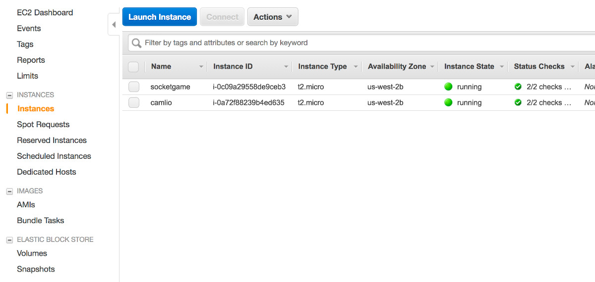
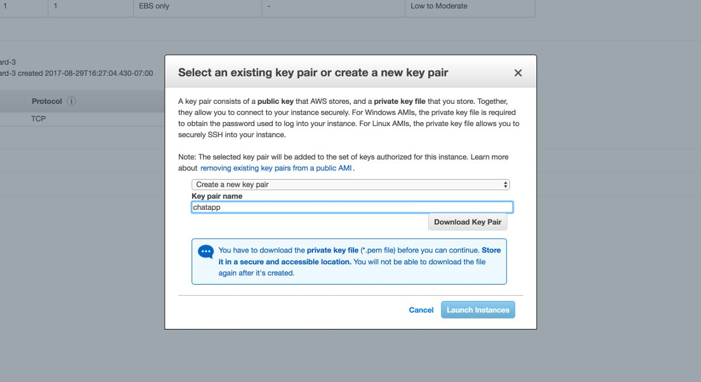
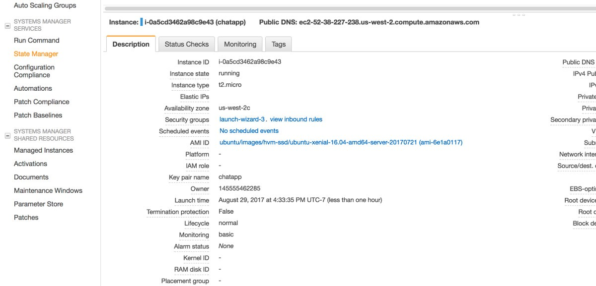
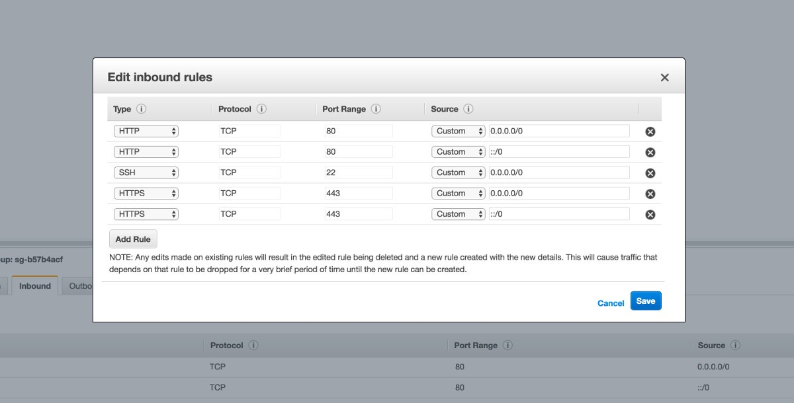
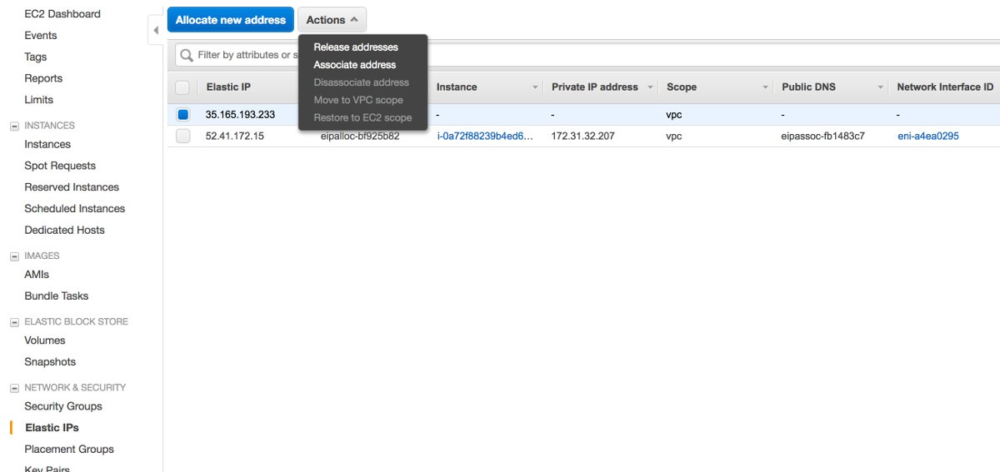
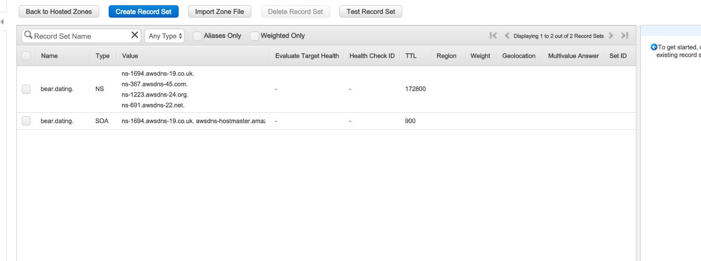
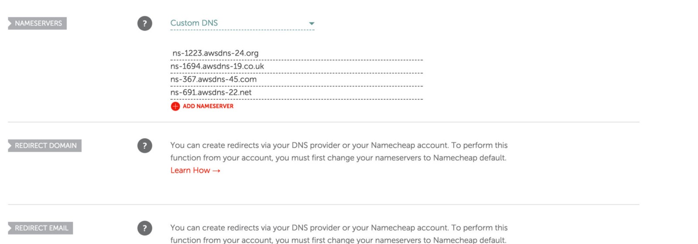

# LET'S ENCRYPT

# Configurando um servidor HTTPS com Node, Amazon EC2, NGINX e Let's Encrypt

https://blog.cloudboost.io/setting-up-an-https-sever-with-node-amazon-ec2-nginx-and-lets-encrypt-46f869159469

Após a terceira vez que configurei um servidor com essas tecnologias, comecei a ficar incomodado por ter que lembrar de todas as etapas diferentes para fazer tudo funcionar em conjunto. Eu realmente gosto dessa combinação de tecnologias e quero agregar todas as etapas em uma única página.

Visite o site do Amazon EC2 . Inscreva-se, se necessário, navegue até a página principal do EC2. Clique em "Instances" à esquerda e depois em "Launch Instance".



Você então será mostrado uma lista de imagens do servidor que você pode selecionar. Eu sempre vou com o Ubuntu Server 16.04. Em seguida, você será solicitado para um tipo de instância, com o tipo t2.micro livre já selecionado. Se você não se importar em pagar, pode selecionar um tipo melhor neste momento. Em seguida, clique em “Review and Launch” e depois em “Launch” na página seguinte.

Agora você criará um par de chaves que permitirá que você se conecte ao seu servidor via SSH, o que faremos daqui a pouco. Selecione "Criar um novo par de chaves" e nomeie-o. Faça o download do arquivo de chaves e salve-o em algum lugar seguro. Como o aviso da Amazon indica, você não poderá baixar o arquivo novamente. Em seguida, clique em "Iniciar instâncias".



De volta à página principal do EC2, você verá sua nova Instância quando clicar em "Instâncias" novamente. Você pode nomear clicando no lápis abaixo da coluna "Nome". Com sua instância selecionada, um painel "Descrição" mostrará mais detalhes. Clique no link ao lado de "Grupos de segurança", que é chamado de "launch-wizard-3" para mim aqui.



Aqui, precisaremos configurar nossos protocolos HTTP e HTTPS, pois somente o SSH é ativado por padrão. No painel inferior, clique na guia "Entrada" e clique em "Editar". Clique em “Adicionar regra” com “Tipo” definido como “HTTP” e “Fonte” definido como “Qualquer lugar”. Em seguida, repita isso com "HTTPS" em vez de "HTTP" e salve.



Agora vamos configurar um IP elástico para esta instância. No painel esquerdo da página principal do EC2, clique em "Elastic IPs" e, em seguida, em "Allocate new address". Depois de criar esse IP, navegue de volta para a página principal “Elastic IPs”, selecione esse novo IP e clique em “Actions” e depois em “Associate address”.



Você selecionará sua instância e IP de instância privada e fará a associação. Quando você voltar para "Instances", o painel "Descrição" mostrará seu novo endereço IP ao lado de "IPv4 Public IP". Copie esse endereço IP em algum lugar.


## Gerenciar DNS com Route 53 (Pago)

Atenção: caso seu domínio esteja comprado na GoDaddy você pode simplesmente copiar o seu IP Público (Elástic IP) para lá e deixar que o Gerenciador de Domínios da GoDaddy faça o serviço. Porém, caso deseje pagar $0,50 por mês para a Amazon utilize o Route 53.

Vamos configurar uma Hosted Zone através do Amazon Route 53 para obter Servidores de Nomes para o nosso domínio que apontam para o nosso novo endereço IP. No canto superior esquerdo de qualquer página do Amazon Web Services, deve haver uma guia "Serviços". Você pode clicar e ir para o "Route 53" a partir daí.

Clique em “Hosted zones” no painel esquerdo, clique em “Create Hosted Zone”. Digite seu domínio e clique em "Criar". Você será navegado aqui:




Clique em "Criar conjunto de registros". Deixe o campo "Nome" em branco e coloque seu Elastic IP no campo "Valor" e clique em "Criar". Clique em “Create Record Set” novamente e agora coloque “www” no campo “Name”. Coloque seu IP no campo "Valor" novamente e clique em "Criar".

Você deve ter quatro conjuntos de registros agora, dois do tipo "A", um "NS" e um "SOA". Os valores para "NS" são seus servidores de nomes. Deve haver quatro domínios do Servidor de Nomes que você copiará agora, excluindo o período no final de cada um que a Amazon adiciona aqui.

Neste ponto, precisarei do meu nome de domínio para o arquivo de configuração do NGINX e para quando configurarmos o Let's Encrypt. Eu registrei “horizon.palin.tech” que é o domínio que tenho, então vou usá-lo para este tutorial.

Direcione seu domínio para esses Servidores de Nomes no site do seu Registrador. Estou usando o GoDaddy:



Ao invés de deixar o Servidor de Nomes da GoDaddy fazer o serviço, utilize a opção Custom DNS e configure os nomes dos servidores da Route 53 lá.

Veja um excelente tutorial sobre isso aqui. (usei http://embedyoutube.org/)
para gerar o link para o vídeo do Youtube.

[](http://www.youtube.com/watch?v=rIXomzvf-Zk "Route 53 DNS")


Depois de um tempo, seu domínio deve ter sido associado a sua instância.

Agora vamos SSH em nossa nova instância! Estou no Linux, então vou usar o programa Terminal. Se você está no Windows, não sei quais são os melhores programas SSH disponíveis, mas parece que o Putty é popular ou o Bitvise SSH Client.

É aqui que vamos usar nosso arquivo de chaves .pem que baixamos antes. Mas primeiro, precisamos alterar as permissões para esse arquivo.

```bash
chmod 600 chave_site_amazon.pem
```

Você precisará do seu IP e da localização do seu arquivo .pem. Você pode simplesmente arrastar e soltar o arquivo no Terminal. Você executará este comando para conectar-se, substituindo por suas próprias informações:

```bash
ssh -i chave_site_amazon.pem ubuntu@35.165.193.233
```

Instale o NGNIX:

sudo apt-get update
sudo apt-get install nginx
sudo service nginx start

Tutorial a ser seguido:
## https://certbot.eff.org/lets-encrypt/ubuntuxenial-nginx

Agora vamos configurar Vamos criptografar. Eu estou usando um tutorial acima . Se você não estiver usando minha configuração exata com o NGINX e o Ubuntu 16.04, talvez seja necessário visitar o site caso haja uma configuração diferente. Mas para nós, vamos executar isso:

```
sudo apt-get update
sudo apt-get install software-properties-common
sudo add-apt-repository ppa:certbot/certbot
sudo apt-get update
sudo apt-get install python-certbot-nginx
```

Agora edite o arquivo **default** do **NGNIX** e coloque o nome do seu domínio:

Obs: veja que ainda está configurado para o Certificado SSL da GoDaddy (pago).

```json

# Default server configuration

server {
	listen                          80;
	server_name                     horizon.palin.tech;
	return 301                      https://$server_name$request_uri;
}

server {

	listen 443 default_server;
	
    	ssl_certificate    /etc/ssl/webservice.palin.tech.chained.crt; 
    	ssl_certificate_key    /etc/ssl/webservice.palin.tech.key;

	ssl on;
    	ssl_session_cache  builtin:1000  shared:SSL:10m;
    	ssl_protocols  TLSv1 TLSv1.1 TLSv1.2;
    	ssl_ciphers HIGH:!aNULL:!eNULL:!EXPORT:!CAMELLIA:!DES:!MD5:!PSK:!RC4;
    	ssl_prefer_server_ciphers on;

	root /var/www/html/webservice/public;

	# Add index.php to the list if you are using PHP
	index index.php index.html index.htm index.nginx-debian.html;

	server_name webservice.palin.tech;

	location / {
		# proxy_pass http://localhost:8000; 
        	proxy_set_header Host $host;

        	# re-write redirects to http as to https, example: /home
        	proxy_redirect http:// https://;

		index index.html index.htm index.php;
    		try_files $uri $uri/ /index.php?$args;
	}

	# pass the PHP scripts to FastCGI server listening on 127.0.0.1:9000
	#
	location ~ \.php$ {
		include snippets/fastcgi-php.conf;
	
		# With php7.0-cgi alone:
	#	fastcgi_pass 127.0.0.1:9000;
		# With php7.0-fpm:
		fastcgi_pass unix:/run/php/php7.2-fpm.sock;

 	# CORS settings
    	# http://enable-cors.org/server_nginx.html
    	# http://10.10.0.64 - Coloque os IPs permitidos somente! It's my front end application
    	
		# Decomentar se Nao Funcionar
		# add_header 'Access-Control-Allow-Origin' '*'; # Inseguro TODOS!
    	# add_header 'Access-Control-Allow-Credentials' 'true';
    	# add_header 'Access-Control-Allow-Methods' 'GET, POST, DELETE, PUT';
    	#add_header 'Access-Control-Allow-Headers' #'Version,Accept,Accept-Encoding,Accept-Language,Connection,Coockie,Authorization,DNT,X-CustomHeader,Keep-Alive,User-Age#nt,X-Requested-With,If-Modified-Since,Cache-Control,Content-Type';
  }

}


# Virtual Host configuration for example.com
#
# You can move that to a different file under sites-available/ and symlink that
# to sites-enabled/ to enable it.
#
#server {
#	listen 80;
#	listen [::]:80;
#
#	server_name example.com;
#
#	root /var/www/example.com;
#	index index.html;
#
#	location / {
#		try_files $uri $uri/ =404;
#	}
#}

```

Agora vamos gerar o Certificado Livre com o comando:

```
sudo certbot --nginx -d horizon.palin.tech
```

```
ubuntu@ip-172-31-20-77:/etc/nginx/sites-available$ sudo certbot --nginx -d horizon.palin.tech
Saving debug log to /var/log/letsencrypt/letsencrypt.log
Plugins selected: Authenticator nginx, Installer nginx
Enter email address (used for urgent renewal and security notices) (Enter 'c' to
cancel): marcelo.palin@gmail.com
Starting new HTTPS connection (1): acme-v02.api.letsencrypt.org

- - - - - - - - - - - - - - - - - - - - - - - - - - - - - - - - - - - - - - - -
Please read the Terms of Service at
https://letsencrypt.org/documents/LE-SA-v1.2-November-15-2017.pdf. You must
agree in order to register with the ACME server at
https://acme-v02.api.letsencrypt.org/directory
- - - - - - - - - - - - - - - - - - - - - - - - - - - - - - - - - - - - - - - -
(A)gree/(C)ancel: A

- - - - - - - - - - - - - - - - - - - - - - - - - - - - - - - - - - - - - - - -
Would you be willing to share your email address with the Electronic Frontier
Foundation, a founding partner of the Let's Encrypt project and the non-profit
organization that develops Certbot? We'd like to send you email about our work
encrypting the web, EFF news, campaigns, and ways to support digital freedom.
- - - - - - - - - - - - - - - - - - - - - - - - - - - - - - - - - - - - - - - -
(Y)es/(N)o: Y

Waiting for verification...
Cleaning up challenges
Deploying Certificate to VirtualHost /etc/nginx/sites-enabled/default

Please choose whether or not to redirect HTTP traffic to HTTPS, removing HTTP access.
- - - - - - - - - - - - - - - - - - - - - - - - - - - - - - - - - - - - - - - -
1: No redirect - Make no further changes to the webserver configuration.
2: Redirect - Make all requests redirect to secure HTTPS access. Choose this for
new sites, or if you're confident your site works on HTTPS. You can undo this
change by editing your web server's configuration.
- - - - - - - - - - - - - - - - - - - - - - - - - - - - - - - - - - - - - - - -

>>> RESPONDA 2 - para redirecionar todo http para https

Select the appropriate number [1-2] then [enter] (press 'c' to cancel): 2
Redirecting all traffic on port 80 to ssl in /etc/nginx/sites-enabled/default

- - - - - - - - - - - - - - - - - - - - - - - - - - - - - - - - - - - - - - - -
Congratulations! You have successfully enabled https://horizon.palin.tech

You should test your configuration at:
https://www.ssllabs.com/ssltest/analyze.html?d=horizon.palin.tech
- - - - - - - - - - - - - - - - - - - - - - - - - - - - - - - - - - - - - - - -

IMPORTANT NOTES:
 - Congratulations! Your certificate and chain have been saved at:
   /etc/letsencrypt/live/horizon.palin.tech/fullchain.pem
   Your key file has been saved at:
   /etc/letsencrypt/live/horizon.palin.tech/privkey.pem
   Your cert will expire on 2018-12-21. To obtain a new or tweaked
   version of this certificate in the future, simply run certbot again
   with the "certonly" option. To non-interactively renew *all* of
   your certificates, run "certbot renew"
 - If you like Certbot, please consider supporting our work by:

   Donating to ISRG / Let's Encrypt:   https://letsencrypt.org/donate
   Donating to EFF:                    https://eff.org/donate-le
```

## Pronto!!


Na mensagem você recebe que seu certificado foi salvo em 

```
/etc/letsencrypt/live/horizon.palin.tech/fullchain.pem
```

e sua chave foi salva em:

```bash
/etc/letsencrypt/live/horizon.palin.tech/privkey.pem
```

E ele já alterou seu **default** do **NGINX**:

```json

# Default server configuration

#
# Resultado Final depois de Instalado o Certificado Let's Encrypt
#

server {
	listen                          80;
	server_name                     horizon.palin.tech;
	return 301                      https://$server_name$request_uri;
}

server {

	listen 443 default_server; # managed by Certbot
    ssl_certificate /etc/letsencrypt/live/horizon.palin.tech/fullchain.pem; # managed by Certbot
    ssl_certificate_key /etc/letsencrypt/live/horizon.palin.tech/privkey.pem; # managed by Certbot
    # include /etc/letsencrypt/options-ssl-nginx.conf; # managed by Certbot
    #ssl_dhparam /etc/letsencrypt/ssl-dhparams.pem; # managed by Certbot


	ssl on;
    ssl_session_cache  builtin:1000  shared:SSL:10m;
    ssl_protocols  TLSv1 TLSv1.1 TLSv1.2;
    ssl_ciphers HIGH:!aNULL:!eNULL:!EXPORT:!CAMELLIA:!DES:!MD5:!PSK:!RC4;
    ssl_prefer_server_ciphers on;

	root /var/www/html/webservice/public;

	# Add index.php to the list if you are using PHP
	index index.php index.html index.htm index.nginx-debian.html;

	server_name horizon.palin.tech;

	location / {
		# proxy_pass http://localhost:8000; 
        	proxy_set_header Host $host;

        	# re-write redirects to http as to https, example: /home
        	proxy_redirect http:// https://;

		index index.html index.htm index.php;
    		try_files $uri $uri/ /index.php?$args;
	}

	# pass the PHP scripts to FastCGI server listening on 127.0.0.1:9000
	#
	location ~ \.php$ {
		include snippets/fastcgi-php.conf;
		# With php7.0-cgi alone:
		# With php7.0-fpm:
		fastcgi_pass unix:/run/php/php7.2-fpm.sock;
  }

}

```

Não esqueça de comentar estas linhas:

```
    # include /etc/letsencrypt/options-ssl-nginx.conf; # managed by Certbot
    #ssl_dhparam /etc/letsencrypt/ssl-dhparams.pem; # managed by Certbot
```

Se não comentá-las não funciona!

Lembrando que o Laravel está instalado na pasta:

/var/www/html/webservice/public;


Execute o teste:


# Detalhes da implantação na Amazon

Tive que limpar o Cache do Composer

https://medium.com/zenchef-tech-and-product/how-to-fix-the-composer-update-failure-asking-you-to-update-a-package-and-unable-to-remove-it-8677af7730c

