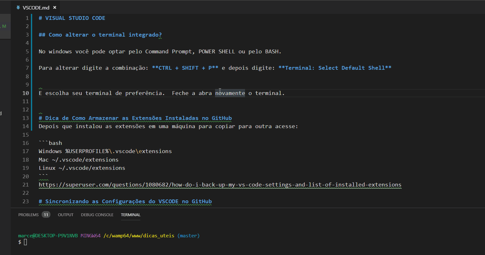

# VISUAL STUDIO CODE

## Como alterar o terminal integrado?

No windows você pode optar pelo Command Prompt, POWER SHELL ou pelo BASH.

Para alterar digite a combinação: **CTRL + SHIFT + P** e depois digite: **Terminal: Select Default Shell**


E escolha seu terminal de preferência.  Feche a abra novamente o terminal.




## Como fazer um Gif Animado e Incorporá-lo?

Para fazer utilizei o ScreenToGif:

https://www.screentogif.com/?l=pt_br


```html

```

# Dica de Como Armazenar as Extensões Instaladas no GitHub
Depois que instalou as extensões em uma máquina para copiar para outra acesse:

```bash
Windows %USERPROFILE%\.vscode\extensions
Mac ~/.vscode/extensions
Linux ~/.vscode/extensions
```
https://superuser.com/questions/1080682/how-do-i-back-up-my-vs-code-settings-and-list-of-installed-extensions

# Sincronizando as Configurações do VSCODE no GitHub

Settings Sync é um pacote para guardar as configurações. Para isto acontecer instale o VSCode na máquina e depois a extensão:

http://shanalikhan.github.io/2015/12/15/Visual-Studio-Code-Sync-Settings.html


FIGURA está no Windows

